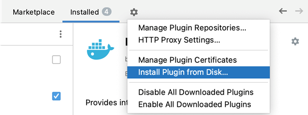

# Uživatelská příručka
Plugin Class Diagram je dostupný jako open source pro vývojová prostředí IntelliJ IDEA a NetBeans IDE. Instalační soubory, zdrojové kódy i uživatelská příručka v anglickém jazyce jsou dostupné na gitlabu.

Plugin Class diagram je určen pro vytváření a zobrazování class diagramů ze zdrojových kódů Java aplikací. Tím poskytne podporu programátorovi vizualizací struktury jeho programu. Class diagramy je možné vytvářet pouze ze zdrojového kódu v jazyce Java z projektu ve vývojovém prostředí, přičemž v nich není možné následně žádné prvky přidávat ani odebírat jinak než změnou daného kódu.

##	Instalace IntelliJ IDEA plugin
Instalace probíhá stejně jako je popsáno v oficiální dokumentaci IntelliJ (https://www.jetbrains.com/help/idea/managing-plugins.html). Nejprve si stáhněte soubor [ClassDiagramIdea.zip](install/ClassDiagramIdea.zip). V prostředí IntelliJ IDEA stiskněte `CTRL+ALT+S` čímž se dostanete do nastavení a otevřete sekci *Plugins*. Na stránce Plugins klikněte na tlačítko *Settings* a poté na *Install Plugin from Disk…*

Vyberte stažený soubor `ClassDiagramIdea.zip` a klikněte na *OK*. Plugin by nyní měl být již plně připraven.

##	Instalace NetBeans IDE plugin
Pro instalaci pluginu si z repositáře stáhněte instalační soubor [`ClassDiagramNB.nbm`](install\ClassDiagramNB.nbm). V NetBeans IDE klikněte na *Tools>Plugins*. V okně Plugins vyberte sekci Downloaded a klikněte na *Add plugins…*. Vyberte stažený soubor `ClassDiagramNB.nbm` a klikněte na *Open*. Poté klikněte na *Install/ a projděte proces instalace. Po dokončení by měl být plugin již plně připraven.

##	Vytvoření a update class diagramu
Class diagramy se vytváří pro každý balíček zvlášť a nejsou mezi sebou vzájemně provázané. Po vytvoření diagramu pro konkrétní balíček stačí v panelu Projekt kliknout sekundárním tlačítkem na zvolený balíček a z nabídky vybrat možnost *Create Class diagram*. Pokud je kód v balíčku bez chyb, které by zabránily jeho kompilaci, vytvoří se v balíčku soubor package.bluej a otevře se panel s diagramem. V případě, že kód nelze kompilovat, pokus o vytvoření končí chybou, opravte tedy kód a celý postup zopakujte.

Diagram se sám neaktualizuje při změně kódu ani běžné kompilaci programu. Pro synchronizaci diagramu s aktuálním stavem programu postupujte stejně jako při vytváření, nad zvoleným balíčkem vyberte možnost *Create Class diagram*. Jestliže už je soubor `pakage.bluej` vytvořený, *Create Class diagram* pouze promítne aktuální stav do původního class diagramu. Odeberou se již neexistující vazby a třídy, stejně tak jejich proměnné, metody, či stereotypy a přidají se nové. Třídám, které v balíčku zůstaly budou, se zachová pozice a velikost před updatem. Nové třídy se umístí do volného prostoru se základní velikostí.

Třídy jsou identifikovány názvem. Pokud tedy dojde k přejmenování pravděpodobně dojde k jejich přemístění nebo změně velikosti.

##	Class diagram
Panel class diagramu je interaktivní zobrazení struktury balíčku. 

Class diagram balíčku se otevírá v panelu Projekt kliknutím sekundárním tlačítkem na zvolený balíček a z nabídky výběrem možnosti *Open Class diagram*. Položka *Open Class diagram* je použitelná pouze pokud je v balíčku soubor `package.bluej`.

###	Úprava diagramu
V digramu je možné měnit pouze velikost a pozici tříd, vazby mezi nimi se automaticky přizpůsobují aktuálnímu rozložení a není možné je měnit. Při stisknutí primárního tlačítka myši a tažení třídy se zobrazí její náhled. 

Pro změnu pozice třídy v diagramu stiskněte primární tlačítko myši nad danou třídou, a táhněte myší na požadované místo v diagramu, kde tlačítko uvolněte. Třída se přesune přesně na místo, kde je náhled zobrazen při uvolnění primárního tlačítka myši.

Pro změnu velikosti třídy stiskněte primární tlačítko myši nad okrajem třídy. Tažením se nyní mění velikost třídy, což opět znázorňuje její náhled. Primární tlačítko uvolněte, jakmile bude náhled mít vámi požadovanou velikost. 

### Ukládání diagramu
Rozložení diagramu se ukládá automaticky při zavření panelu s diagramem. Úpravy nelze vrátit zpět, pouze provést další úpravy do původního rozložení.

### Rozbalení a sbalení tříd
Třídy jsou při každém otevření diagramu ve sbaleném stavu, tak se zobrazuje pouze jejich název a stereotyp. Pro zobrazení proměnných a metod lze třídu rozbalit dvojkli-kem. Při rozbalení se třída zvětší a zobrazí všechny proměnné i metody třídy. Dvojklik nad rozbalenou třídou ji zmenší zpět do původní velikosti a přestanou se zobrazovat proměnné a metody třídy.

## Export diagramu
Diagram je možné exportovat do obrázku ve formátu PNG. Pro export diagramu do obrázku klikněte sekundárním tlačítkem myši na diagram a vyberte možnost Save as image. Po vybrání cesty a názvu souboru, klikněte na Uložit. Diagram se exportuje tak jak je aktuálně zobrazen, pokud tedy chcete mít některé třídy rozbalené, nebo naopak sbalené (viz Rozbalení a sbalení tříd) je potřeba je do tohoto stavu nejdříve uvést.

##	Smazání diagramu
Pro smazání diagramu stačí smazat soubor package.bluej z vybraného balíčku. Po smazání se zneaktivní možnost Open Class diagram v nabídce balíčku a je pouze možné jej znovu vytvořit.

