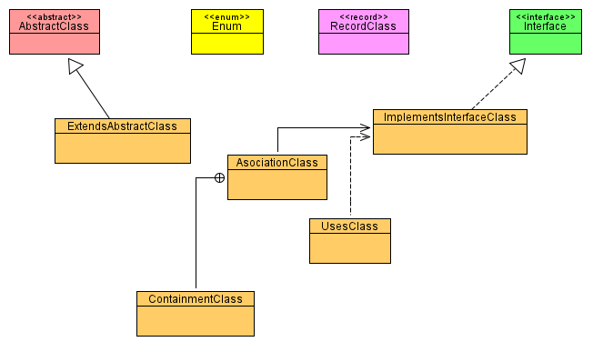
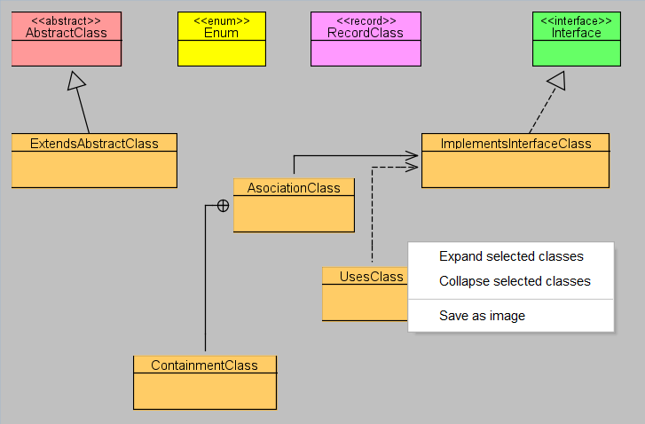

# User guide

Plugin Class Diagram is an open source plugin for IntelliJ IDEA and NetBeans IDE.

Plugin Class Diagram allows to create and view class diagrams of Java apps. Diagram can be made only from application source code, there is no other way to add or delete any element of diagram than to chage the source code.

## Install IntelliJ IDEA plugin
For installation in IntelliJ IDEA follow the steps of the official documentation (https://www.jetbrains.com/help/idea/managing-plugins.html). Firstly you must download [ClassDiagramIdea.zip](install/ClassDiagramIdea.zip). In IntelliJ IDEA window press `CTRL+ALT+S` and select *Plugins*, then choose *Settings* and *Install Plugin from Disk…*.

Choose the previously downloaded file `ClassDiagramIdea.zip` and select *OK*./

## Install NetBeans IDE plugin
For installation in NetBeans IDE download [`ClassDiagramNB.nbm`](install\ClassDiagramNB.nbm). In NetBeans IDE select *Tools>Plugins*. In window Plugins chooose *Downloaded*>*Add plugins…*. Find the previously downloaded file `ClassDiagramNB.nbm` and select *Open*. Click *Install* and wlak through the isntallation.

## Create and update class diagram
Class diagram is made for a single package and are not conected with each other. Diagram is created by choosing *Create Class diagram* from package context menu in Project panel. If there is any problem in the source code of the selected package diagram is not created and you must fix the code before you can create the diagram.

Diagram is static and your changes in code are not represented until you recreate it in same way as was created for the first time. Update of diagram will keep as many settings as possible, your class elements should keep their place and size until you rename or delete it.

##	Class diagram
Panel with class diagram is an interactive view of package code structure.

Diagram is shown in own new tab. You can open an already created diagram by choosing *Open Class diagram* option in package context menu.

###	Diagram layout
Diagram can be changed only in terms of size and position of classes. Dependencies adjust automaticaly to current layout and it is not possible to change their layout. 

To chage class position or size just drag and drop the class element or its boarder. 

### Save diagram
Diagram and its layout is automaticaly saved when the coresponding tab is closed, there is no other way how to save the diagram.

## Expand and collapse classes
The classes show only basic information in default. To see its variables and methods you can expand it. Expansion and colapssion can be done either doble clicking selected class or through *Expand selected classes* or *Collapse selected classes* in diagram context menu.

## Hide and show diagram elements
Through diagram context menu you can hide or show elements of diagram. All dependencies of selected type can be hidden or shown by selecting/deselecting it in diagram context menu *Select visible dependencies*.

Every class can be hidden or shown by selecting/deselecting it in popup window through *Select visible classes* in diagram context menu.

## Export diagram
You can export the diagram as a PNG picture. That is done through diagram context menu option *Save as image*. The picture is exactly same as current view of diagram, inluding expanded classes and hiddend classes or dependencies.

## Delete diagram
You can delete diagram by deleting `package.bluej` in proper package. When file is deleted *Open Class diagram* option in package context menu is disabled and you can only create it again.
